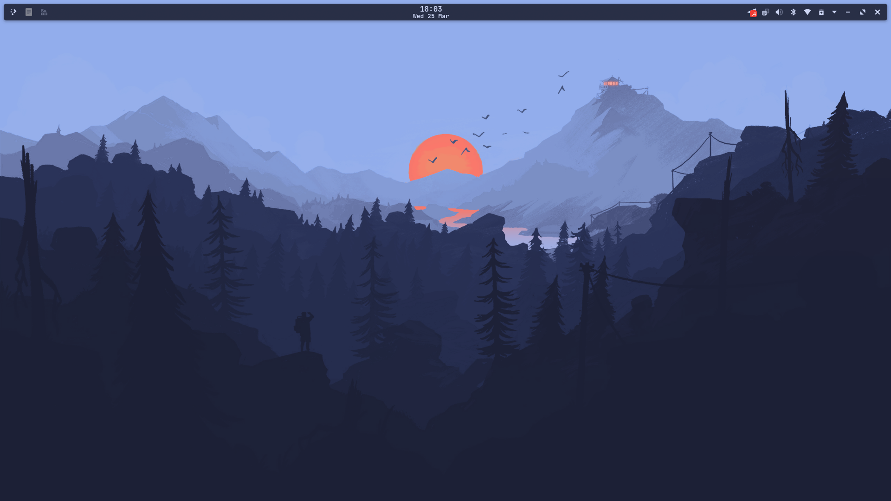
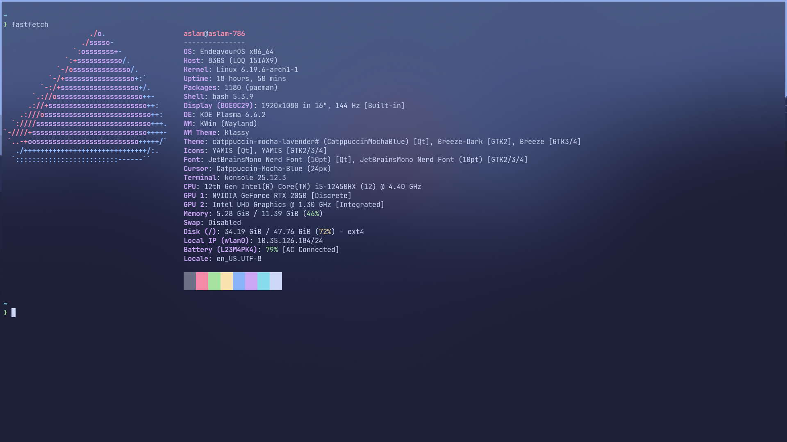

<div align="center">

# 🏰 Aslam's Lair

*My personal dotfiles for EndeavourOS — KDE Plasma + Catppuccin Mocha*

[](https://endeavouros.com)
[](https://kde.org)
[](https://github.com/catppuccin)
[](https://wayland.freedesktop.org)

</div>

---

## 📸 Previews

### Desktop


### Terminal (fastfetch)


---

## ⚙️ Setup Details

| Component | Tool |
|---|---|
| OS | EndeavourOS x86_64 |
| Kernel | Linux 6.19.6-arch1-1 |
| DE | KDE Plasma 6.6.2 |
| WM | KWin (Wayland) |
| Tiling | Polonium |
| Theme | Catppuccin Mocha Blue |
| Window Decorations | Klassy |
| App Styling | Kvantum |
| Terminal | Konsole |
| Shell | Bash + Starship |
| App Launcher | Rofi Wayland |
| Font | JetBrainsMono Nerd Font |
| Icons | YAMIS |

---

## 📦 What's Included

```
Aslams-Lair/
├── bash/         # .bashrc, .bash_profile + Starship init
├── kde/          # KDE Plasma, KWin, Klassy, panel layout
├── konsole/      # Konsole profile + Catppuccin color scheme
├── kvantum/      # Kvantum Catppuccin Mocha config
├── themes/       # Catppuccin Mocha Blue look-and-feel
├── fonts/        # JetBrainsMono Nerd Font
├── pkglist.txt       # All explicit packages
├── pkglist-aur.txt   # AUR packages only
└── install.sh    # Interactive installer
```

---

## 🚀 Install

> ⚠️ This installer is password protected.

```bash
curl -fsSL https://raw.githubusercontent.com/aslamsheikh786/Aslams-Lair/main/install.sh -o install.sh
chmod +x install.sh
bash install.sh
```

The installer will ask for a password, then give you options to install everything at once or pick individual components.

---

## 🔧 Manual Setup

If you prefer to do it manually:

```bash
# 1. Install dependencies
sudo pacman -S stow git

# 2. Clone the repo
git clone https://github.com/aslamsheikh786/Aslams-Lair.git ~/dotfiles

# 3. Install packages
sudo pacman -S - < ~/dotfiles/pkglist.txt
yay -S - < ~/dotfiles/pkglist-aur.txt

# 4. Stow configs
cd ~/dotfiles
stow bash kde konsole kvantum themes fonts

# 5. Refresh font cache
fc-cache -fv
```

---

<div align="center">


*Made with 🤍 by [aslamsheikh786](https://github.com/aslamsheikh786)*

</div>
